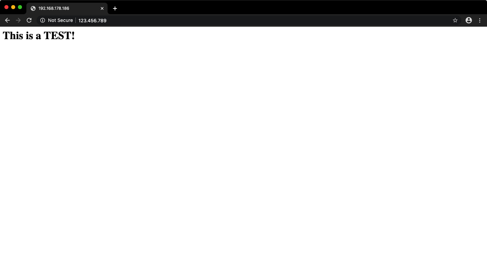
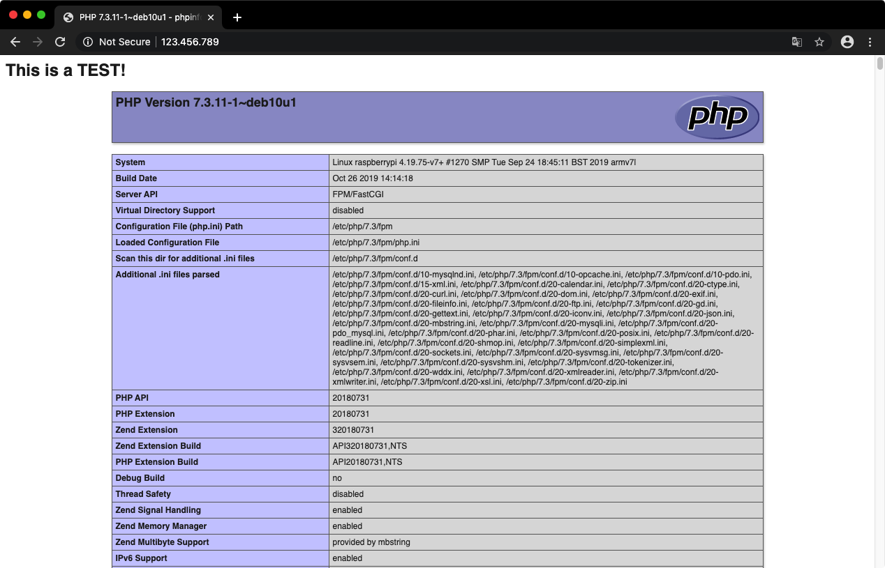

# Raspberry Pi & 3.5" TFT & Chromium as Kiosk

> Tested with *Raspbian GNU/Linux 10 (buster)*

___

- [Raspberry Pi & 3.5" TFT & Chromium as Kiosk](#raspberry-pi--35-tft--chromium-as-kiosk)
  - [To Do](#to-do)
  - [Setup Kiosk](#setup-kiosk)
    - [1. Prepare Raspberry Pi](#1-prepare-raspberry-pi)
    - [2. Use privided Repository](#2-use-privided-repository)
    - [3. Configure Boot overlays](#3-configure-boot-overlays)
      - [1. Enable Interfaces](#1-enable-interfaces)
      - [2. Add the copied boot overly to the config.txt](#2-add-the-copied-boot-overly-to-the-configtxt)
    - [4. Configure command line](#4-configure-command-line)
    - [5. Reboot the Raspberry Pi](#5-reboot-the-raspberry-pi)
    - [6. Enable Interfaces](#6-enable-interfaces)
    - [7. Install GUI components and Chromium](#7-install-gui-components-and-chromium)
      - [1. Minimun GUI components](#1-minimun-gui-components)
      - [2. Chromium](#2-chromium)
    - [8. Edit Openbox config](#8-edit-openbox-config)
      - [1. Config power management](#1-config-power-management)
      - [2. Supress error messages in case of chromium crashing](#2-supress-error-messages-in-case-of-chromium-crashing)
      - [3. Configure Chromium start flags](#3-configure-chromium-start-flags)
    - [9. Edit Openbox env](#9-edit-openbox-env)
    - [10. Configure X server to start on boot](#10-configure-x-server-to-start-on-boot)
    - [11. Configure Xorg](#11-configure-xorg)
    - [12. Configure Cronjob for scheduled reboot](#12-configure-cronjob-for-scheduled-reboot)
  - [Setup lighttpd web server](#setup-lighttpd-web-server)
    - [1. Prepare Raspberry Pi (again)](#1-prepare-raspberry-pi-again)
    - [2. Install and test lighttpd](#2-install-and-test-lighttpd)
    - [3. Install and test php mod](#3-install-and-test-php-mod)
    - [4. Show local webserver on the 3.5" kiosk](#4-show-local-webserver-on-the-35-kiosk)
  - [X. References](#x-references)

___

## To Do

- [X] Test `/usr/share/X11/xorg.conf.d/99-fbturbo.conf` for unnecessary lines
- [X] Local web-server
  - Lighttpd
    - \+ PHP
    - Install as?
      - [X] Bare metal (kiosk will use localhost)
      - Container (Docker)
  - [ ] FTP-Server
- [X] Cron Reboot every day
  - [Cron Setup](http://www.vk3erw.com/index.php/16-software/58-raspberry-pi-how-to-periodic-reboot-via-cron)
- [ ] \(Optional) Add good powersaving options (screen only)

___

## Setup Kiosk

### 1. Prepare Raspberry Pi

1. Install Raspbian Lite
    - Make sure *SSH* is enabled
      - Create an empty file named *ssh* in the `boot` partition

3. Connect via SSH with the username __pi__ - the standard password is "_raspberry_"

2. Update

```bash
  sudo apt-get update && sudo apt-get upgrade
```

3. Install Git

```bash
  sudo apt-get install -y git
```

### 2. Use privided Repository

1. Git Clone [GoodTFT/LCD-show](https://github.com/goodtft/LCD-show)

```bash
  git clone https://github.com/goodtft/LCD-show.git
  cd LCD-show
```

2. Copy boot overlays
  
```bash
  sudo cp ./usr/tft35a-overlay.dtb /boot/overlays/tft35a.dtbo
```

### 3. Configure Boot overlays

#### 1. Enable Interfaces

   Use `sudo raspi-config` and navigate to `5 Interfacing Options` and enable:

- P4  __SPI__
- P5  __I²C__ _(may not be needed)_
- P6  __Serial__ _(may not be needed)_

#### 2. Add the copied boot overly to the `config.txt`

1. Open `/boot/config.txt` with a text editor (e.g. vi or nano) and
add the following at the end:

```
  #Adjust Rotation if needed
  dtoverlay=tft35a:rotate=270
```

2. Adjust Overscan:

```
  # uncomment this if your display has a black border of unused pixels visible
  # and your display can output without overscan
  disable_overscan=0

  # uncomment the following to adjust overscan. Use positive numbers if console
  # goes off screen, and negative if there is too much border
  #overscan_left=16
  #overscan_right=16
  #overscan_top=16
  #overscan_bottom=16
```

3. Also add the following if needed:

```
  # Interface options
  dtparam=spi=on
  dtparam=i2c_arm=on
  enable_uart=1
```

### 4. Configure command line

- Open `/boot/cmdline.txt` with a text editor (e.g. vi or nano)
and add the following at the end of the line:

```
  fbcon=map:10 fbcon=font:ProFont6x11
```

### 5. Reboot the Raspberry Pi

```bash
  sudo reboot
```

### 6. Enable Interfaces

- Use `sudo raspi-config` and navigate to `3 Boot Options`

  - Go to `B1 Desktop / CLI`

    - Select `B2 Console Autologin`

- When asked to reboot, select **Yes**.

### 7. Install GUI components and Chromium

This may take some time!

#### 1. Minimun GUI components

```bash
sudo apt-get install -y --no-install-recommends xserver-xorg x11-xserver-utils xinit openbox
```

#### 2. Chromium

```bash
sudo apt-get install -y --no-install-recommends chromium-browser
```

### 8. Edit Openbox config

> *From [Raspberry Pi Touchscreen Kiosk Setup | desertbot.io](https://desertbot.io/blog/raspberry-pi-touchscreen-kiosk-setup)*:
>
> The Openbox window manager will be used to launch the Chromium browser.
>
> When Openbox launches at startup it will run two scripts in the `/etc/xdg/openbox` folder. The first, environment will setup any environment variables, etc. The second, autostart will setup and launch whatever app you specify.

#### 1. Config power management

- Open `/etc/xdg/openbox/autostart` with a text editor (e.g. vi or nano) and add the following at the end of the file:

```
  xset -dpms       # turn off display power management system
  xset s noblank   # turn off screen blanking
  xset s off       # turn off screen saver
```

#### 2. Supress error messages in case of chromium crashing

- Open `/etc/xdg/openbox/autostart` with a text editor (e.g. vi or nano) and add the following at the end of the file:

```
  # Remove exit errors from the config files that could trigger a warning
  sed -i 's/"exited_cleanly":false/"exited_cleanly":true/' ~/.config/chromium/'Local State'
  sed -i 's/"exited_cleanly":false/"exited_cleanly":true/; s/"exit_type":"[^"]\+"/"exit_type":"Normal"/' ~/.config/chromium/Default/Preferences
```

#### 3. Configure Chromium start flags

- Using the env-var `$KIOSK_URL`
  - Will be created in the next step

```bash
  chromium-browser --noerrdialogs --disable-infobars --incognito --touch-events --kiosk $KIOSK_URL
```

### 9. Edit Openbox env

- Open `/etc/xdg/openbox/environment` with a text editor (e.g. vi or nano) and add the following at the end of the file:

```bash
  export KIOSK_URL=https://google.com
```

- (Optional) Create a symbolic link to the env-var file in the home directory for easy editing

```bash
  ln -s /etc/xdg/openbox/environment ~/env-var
```

### 10. Configure X server to start on boot

1. Create `.bash_profile` in the `/home/pi` directory if it's not existing

```bash
  touch ~/.bash_profile
```

2. Open `~/.bash_profile` with a text editor (e.g. vi or nano) and add the following at the end of the file:

```
  [[ -z $DISPLAY && $XDG_VTNR -eq 1 ]] && startx -- -nocursor
```

3. Validate the file

```bash
  source ~/.bash_profile
```

4. Reboot if no errors occured

```bash
  sudo reboot
```

### 11. Configure Xorg

1. Create `99-fbturbo.conf` in the `/usr/share/X11/xorg.conf.d` directory if it's not existing

```bash
  touch /usr/share/X11/xorg.conf.d/99-fbturbo.conf
```

2. Open `/usr/share/X11/xorg.conf.d/99-fbturbo.conf` with a text editor (e.g. vi or nano) and add the following at the end of the file:

```
Section "InputClass"
   Identifier "calibration"
   MatchProduct "ADS7846 Touchscreen"
   # Hat trick to get the pen to work properly on the touch screen, rotate 90 degrees clockwise:
   Option "TransformationMatrix" "0 -1 1 1 0 0 0 0 1"
   # Touch screen rotation by 90deg
   #Option "TransformationMatrix" "0 1 0 -1 0 1 0 0 1"
   # Don't use libinput but evdev for the touch screen and the pen so calibration works:
   Driver "evdev"
   Option "Calibration"   "3936 227 268 3880"
   Option "InvertY" "true"
   #Option "InvertX" "true"
   # Right mouse button is long press with pen:
   Option "EmulateThirdButton" "1"
   Option "EmulateThirdButtonTimeout" "750"
   Option "EmulateThirdButtonMoveThreshold" "30"
EndSection

Section "Device"
   # WaveShare SpotPear 3.5", framebuffer 1
   Identifier "uga"
   driver "fbdev"
   # Switch to /dev/fb0 for default output (usually hdmi)
   Option "fbdev" "/dev/fb1"
   Option "ShadowFB" "off"
EndSection

Section "Monitor"
   # Primary monitor. WaveShare SpotPear 480x320
   Identifier "WSSP"
EndSection

Section "Screen"
   Identifier "primary"
   Device "uga"
   Monitor "WSSP"
EndSection

Section "ServerLayout"
   Identifier "default"
   Screen 0 "primary"
EndSection
```

3. Install the evdev driver

```bash
  sudo apt-get install -y xserver-xorg-input-evdev
```

4. Reboot the Raspberry Pi

  The Raspberry basic configuration ends after the reboot. In the next steps a local webserver will be installed, so it doesn't rely on an internet connection.

### 12. Configure Cronjob for scheduled reboot

1. Create a cron file `scheduledreboots` in `/etc/cron.d/`

```bash
  touch /etc/cron.d/scheduledreboots
```

2. Open `/etc/cron.d/scheduledreboots` with a text editor (e.g. vi or nano) and add the following:

```
  # m h dom mon dow user command
  30 3 * * * root /sbin/shutdown -r now
```

- The Raspberry will now restart every night at 3:30am

3. Reboot the Raspberry Pi to make sure *Cron* picked up the new job file.

```bash
  sudo reboot
```

- The Raspberry Pi basic configuration ends after the reboot. In the next steps a local webserver will be installed, so it doesn't rely on an internet connection.

___

## Setup lighttpd web server

### 1. Prepare Raspberry Pi (again)

1. Update

```bash
  sudo apt-get update && sudo apt-get upgrade
```

2. Make sure to remove apache

```bash
  sudo apt-get remove apache2
```

### 2. Install and test lighttpd

1. Install lighttpd

```bash
  sudo apt-get install lighttpd
```

2. Create `index.html` in the `/var/www/html/` directory if it's not existing

```bash
  touch /var/www/html/index.html
```

3. Open `/var/www/html/index.html` with a text editor (e.g. vi or nano) and add the following code for testing purposes:

```html
  <h1>This is a TEST!</h1>
```

4. Get your hostname or ip adress

    - IP Adress: Look for `eth0` or `wlan0`

    ```bash
    ip a
    ```

    - Hostname

    ```bash
      hostname -I
    ```

5. Access that host/ip via a web browser from a device in the same network and hope it's showing the `This is a TEST!`-Heading :pray:

> 

### 3. Install and test php mod

1. Install:

```bash
  sudo apt-get install -y php7.3-fpm php7.3-mbstring php7.3-mysql php7.3-curl php7.3-gd php7.3-curl php7.3-zip php7.3-xml
```

2. Enable mods in lighttpd

```bash
  sudo lighttpd-enable-mod fastcgi
  sudo lighttpd-enable-mod fastcgi-php
```

3. Edit the lighttpd fastcgi config

    - Open `/etc/lighttpd/conf-available/15-fastcgi-php.conf` with a text editor (e.g. vi or nano) and replace the contents with:

    ```conf
      # -*- depends: fastcgi -*-
      # /usr/share/doc/lighttpd/fastcgi.txt.gz
      # http://redmine.lighttpd.net/projects/lighttpd/wiki/Docs:ConfigurationOptions#mod_fastcgi-fastcgi

      ## Start an FastCGI server for php (needs the php5-cgi package)
      fastcgi.server += ( ".php" =>
              ((
                      "socket" => "/var/run/php/php7.3-fpm.sock",
                      "broken-scriptfilename" => "enable"
              ))
      )
    ```

4. Reload the lighttpd service

```bash
  sudo service lighttpd force-reload
```

5. Rename the `.html`file to `index.php`

```bash
  sudo mv /var/www/html/index.html /var/www/html/index.php
```

6. Open `/var/www/html/index.php` with a text editor (e.g. vi or nano) and place the following in a new line:

```php
  <?php phpinfo(); ?>
```

- The file should now look like this:

```php
  <h1>This is a  TEST!</h1>
  <?php phpinfo(); ?>
```

7. Access that host/ip via a web browser from a device in the same network and hope it's showing the the php-info :pray:

> 

### 4. Show local webserver on the 3.5" kiosk

1. Open `/etc/xdg/openbox/environment` with a text editor (e.g. vi or nano). If the symlink is present it can be used:

```bash
  sudo nano ~/env-var
```

2. Change the value of the last uncommented line, the env var for openbox, to see the local webserver on the raspberry pi's touchscreen. It should look like this:

```bash
  # Probably some comments
  # More comments

  export KIOSK_URL=localhost
```

___

## X. References

- [Setting up an LCD screen on the Raspberry Pi, 2019 edition](https://avikdas.com/2018/12/31/setting-up-lcd-screen-on-raspberry-pi.html)
- [Raspberry Pi Touchscreen Kiosk Setup | desertbot.io](https://desertbot.io/blog/raspberry-pi-touchscreen-kiosk-setup)
- [GoodTFT 3.5" screen from Aliexpress - Raspberry Pi Forums](https://www.raspberrypi.org/forums/viewtopic.php?t=238060)
- [How to setup Raspberry Pi Lighttpd - Pi My Life Up](https://pimylifeup.com/raspberry-pi-lighttpd/)

_*(Used in that order)*_
